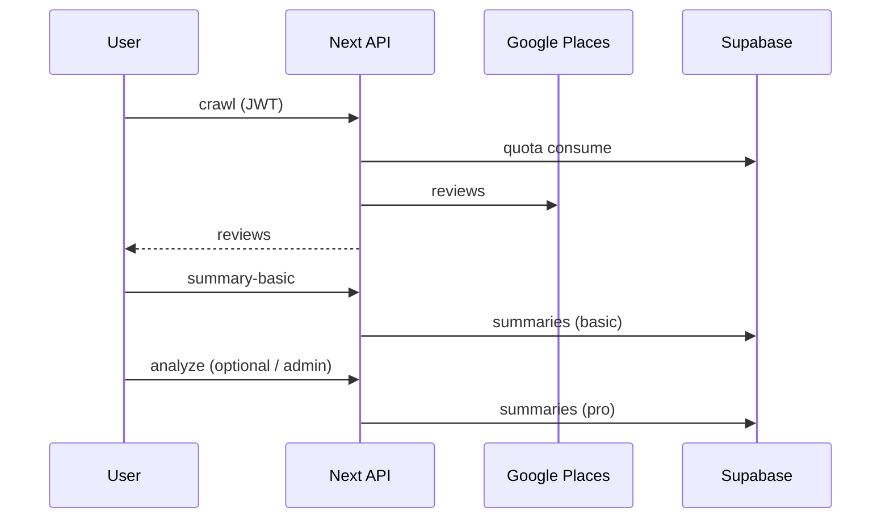

# Before You Go

**언어:** [한국어](./README.ko.md) · [English](./README.md)

Google 리뷰를 모아 **가기 전에** 빠르게 판단할 수 있게 돕는 웹앱입니다. 검색 → 리뷰 수집 → 요약(기본) / 심층 분석(Pro)까지 한 흐름으로 묶었습니다.

---

## 왜 만들었는지

맵에서 식당을 고를 때, 별점만으로는 부족하고 리뷰는 너무 깁니다. “지금 이 장소에 갈지 말지”를 **짧은 시간 안에** 정리해 주는 도구가 있으면 좋겠다는 데서 출발했습니다.

- 리뷰 원문은 서버에서 Places로 가져오고, 사용자에게는 **요약·키워드·메뉴 언급**처럼 스캔하기 쉬운 형태만 보여 줍니다.
- 무료로 쓸 수 있는 범위를 정하려면 **계정·한도**가 필요해서 Supabase 인증과 일일 분석 쿼터를 붙였습니다.
- (여기에 본인만의 이유—예: 포트폴리오, 특정 도시/상황에서의 불편—를 한두 문단 덧붙여도 좋습니다.)

---

## 기술 스택을 이렇게 고른 이유

| 선택 | 이유 |
|------|------|
| **Next.js (Pages Router)** | UI와 `pages/api`로 **비밀 키·쿼터·LLM 호출을 서버에만** 두기 쉽고, Vercel 배포와 잘 맞음. |
| **TypeScript + React** | 리뷰·요약 구조가 필드가 많아 타입으로 맞추는 편이 안전함. |
| **Tailwind + Framer Motion** | 레이아웃/모션을 빠르게 다듬기 위한 실용적인 조합. |
| **Supabase (Auth + Postgres)** | 회원·RLS·트리거/RPC까지 한곳에서 처리; 별도 백엔드 프레임워크 없이도 “유저별 행” 모델이 명확함. |
| **Google Maps / Places** | 식당 발견과 리뷰·메타데이터의 **단일 출처**로 쓰기 적합. |
| **OpenAI 우선, Anthropic·Gemini 대안** | Pro 분석은 **구조화 JSON**이 핵심이라 API가 성숙한 쪽을 기본으로 두고, 키만 있으면 프로바이더를 바꿀 수 있게 함 (`lib/llm/runProAnalysisLlm.ts`). |
| **Stripe (선택)** | 결제는 부가 기능으로 두고, 없어도 검색·요약 플로우는 동작하도록 분리. |

---

## 데이터는 어떻게 설계되어 있는지

**원칙:** “누구 데이터인지”가 항상 분명해야 해서 `user_id` 기준 테이블과 RLS(또는 서비스 롤)를 전제로 짰습니다.

- **`profiles`** — `auth.users`와 1:1. 닉네임·설정·(선택) `is_analysis_admin`으로 운영상 관리자 구분.
- **`summaries`** — 장소(`place_id`)별 결과 캐시. **`is_pro_analysis`**로 **기본 요약**과 **Pro LLM 결과**를 같은 테이블에서 구분해 중복 저장을 줄임. TTL은 앱 로직(`lib/summaryCacheTtl.ts`)으로 갱신 여부 판단.
- **`user_api_usage`** — **일일 분석 횟수**. `analysis_quota_day`(달력 날짜)와 `analysis_requests`를 같이 두어 “날이 바뀌면 0부터”가 되도록 설계. 서버에서만 신뢰할 수 있게 소비(`consume`)와 조회(스냅샷)를 분리 (`lib/apiUsageQuota.ts`).
- **`user_place_clicks`** — 마이페이지 “열람 히스토리”. `(user_id, place_id)` 복합 키로 upsert, **`record_place_click` RPC (SECURITY DEFINER)** 로 클라이언트는 실행만 하고 행 단위 권한은 DB가 책임짐.

스키마 상세와 정책은 `supabase/migrations/`와 `supabase/sql/user_api_usage.sql`을 참고하면 됩니다.

---

## 어떤 방식으로 작동하는지

1. **검색** — 브라우저에서 Maps JS로 주변 식당을 찾고, 카드 선택 시 `placeId`가 잡힘.
2. **기본 분석** — 클라이언트가 `/api/crawl`을 호출하면 서버가 **쿼터를 1 소비**한 뒤 Places에서 리뷰를 가져옴 → 이어서 `/api/summary-basic`이 **통계(평균 별점·비율) + 고정 문장 템플릿**으로 요약을 만들고 `summaries`(비-Pro)에 캐시.
3. **Pro 분석** — `/api/analyze`가 다시 쿼터를 소비하고, 리뷰 텍스트를 `runProAnalysisLlm`에 넣어 **JSON 스키마**에 맞춘 결과를 받은 뒤 `summaries`(Pro)에 저장. 관리자 계정은 쿼터를 건너뛰도록 env/DB 플래그로 분기.
4. **히스토리** — 식당 선택·상세 진입 시 `record-place-click` API가 RPC를 호출해 클릭 수·최근 시각을 누적.



**프롬프트(Pro):** `lib/llm/runProAnalysisLlm.ts`의 `buildPrompt()` 한 곳에 집중. 리뷰는 `MAX_REVIEWS_FOR_ANALYSIS`로 자르고, 모델에는 “JSON만, 지정 키만” 요구해 파싱 실패를 줄임. 기본 요약 경로는 **LLM 없음**—비용·지연·결정성 측면에서 의도적입니다.

---

## 인사이트 (배운 점)

- **RLS만 켜 두고 정책이 없으면** 조용히 실패하거나, UI와 API가 서로 다른 이야기를 할 수 있음. 쿼터처럼 “진실은 서버”인 기능은 **마이그레이션으로 GRANT/정책을 명시**하거나 **서비스 롤**을 쓰는 쪽이 운영이 편함.
- **“한도 소진”과 “시스템 오류”를 사용자에게 같은 문구로 보여 주면 안 됨.** 스냅샷에 `quotaUnavailable` 같은 플래그를 두어 의미를 나눴습니다.
- **기본 vs Pro를 같은 `summaries`에 `is_pro_analysis`로 구분**하면 캐시·마이그레이션·쿼리가 단순해짐.
- **SECURITY DEFINER RPC**는 히스토리처럼 “항상 규칙대로 upsert”해야 할 때 클라이언트 RLS 실수를 줄여 줌.
- Places·LLM은 모두 **외부 쿼터**가 있어서, 앱 레벨 일일 한도는 **비용·악용 방지**용으로 따로 두는 것이 현실적임.

---

## 로컬에서 돌리기

```bash
npm install
cp .env.example .env.local   # 값 채우기
npm run dev
```

- 변수 설명은 **`.env.example`**을 기준으로 두었습니다.
- DB는 Supabase에 프로젝트 만든 뒤 `supabase/migrations/` 순서에 맞게 적용하세요. 특히 **`user_api_usage` RLS**와 **`user_place_clicks` + `record_place_click`**는 마이페이지·쿼터에 필요합니다.

```bash
npm run build
```

---

## 배포·보안 (짧게)

- Vercel에 연결한 뒤 `.env.example`에 있는 항목을 프로젝트 환경 변수로 복사합니다.
- **`.env.local`은 커밋하지 마세요.** 서비스 롤·Stripe·LLM 키는 **`NEXT_PUBLIC_` 접두사 없이** 서버 전용으로만 둡니다.
- `NEXT_PUBLIC_*`는 브라우저에 노출된다고 가정하고 Anon 키·Maps 키(제한 설정)만 넣습니다.

---

## 기타

- `@supabase/auth-helpers-nextjs`는 업계에서 deprecated 안내가 나올 수 있습니다. 추후 `@supabase/ssr` 등으로 옮길 여지는 있습니다.
