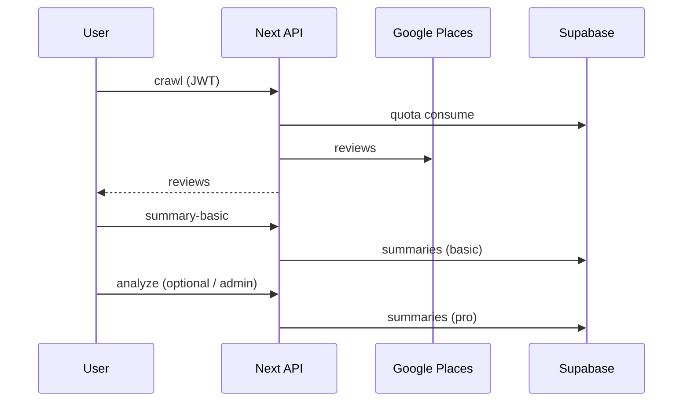

# Before You Go

**Languages:** English · [한국어 (Korean)](./README.ko.md)

A web app that gathers Google reviews and helps you decide **before you go**: search → fetch reviews → basic summary or deeper **Pro** analysis in one flow.

---

## Why this project exists

When picking a restaurant on a map, star averages are thin and full reviews are long. This started from wanting a tool that answers “should I go here **right now**?” in a short amount of time.

- Raw reviews are pulled on the server via Places; the UI focuses on **scannable** output—summary, keywords, menu mentions.
- To bound free usage you need **accounts and limits**, so the app adds Supabase auth and a **daily analysis quota**.
- (Add your own paragraph here—portfolio, a city you care about, a specific pain you felt.)

---

## Why this tech stack

| Choice | Rationale |
|--------|-----------|
| **Next.js (Pages Router)** | Keeps **secrets, quota, and LLM calls on the server** via `pages/api`; deploys cleanly on Vercel. |
| **TypeScript + React** | Review and summary shapes are field-heavy; types reduce mistakes. |
| **Tailwind + Framer Motion** | Practical combo for layout and motion without a heavy design system. |
| **Supabase (Auth + Postgres)** | Auth, RLS, triggers/RPC in one place; clear per-user row model without a separate backend framework. |
| **Google Maps / Places** | Single source for discovery and review/metadata. |
| **OpenAI default; Anthropic / Gemini optional** | Pro analysis is **structured JSON** first; default to a mature API and swap providers by env keys (`lib/llm/runProAnalysisLlm.ts`). |
| **Stripe (optional)** | Billing stays optional so search and summaries work without it. |

---

## How data is modeled

**Principle:** ownership must always be obvious—tables keyed by `user_id` plus RLS (or service role) on the server.

- **`profiles`** — 1:1 with `auth.users`. Nickname, settings, optional `is_analysis_admin` for ops.
- **`summaries`** — Per-place (`place_id`) cache. **`is_pro_analysis`** splits **basic** vs **Pro LLM** rows in one table to avoid parallel schemas. TTL / refresh is decided in app code (`lib/summaryCacheTtl.ts`).
- **`user_api_usage`** — **Daily analysis count**. `analysis_quota_day` + `analysis_requests` so usage resets per calendar day. Server-only **consume** vs read-only **snapshot** (`lib/apiUsageQuota.ts`).
- **`user_place_clicks`** — My-page open history. Composite key `(user_id, place_id)` with upserts; **`record_place_click` RPC (SECURITY DEFINER)** so clients call one entry point and the database enforces row rules.

See `supabase/migrations/` and `supabase/sql/user_api_usage.sql` for schema and policies.

---

## How it runs

1. **Search** — Maps JS in the browser finds nearby places; selecting a card fixes `placeId`.
2. **Basic analysis** — `/api/crawl` **consumes quota**, fetches reviews from Places, then `/api/summary-basic` builds a **stats + fixed template** summary (no LLM) and caches under `summaries` (non-Pro).
3. **Pro analysis** — `/api/analyze` consumes quota again, sends review text through `runProAnalysisLlm` for **JSON-shaped** output, stores Pro rows in `summaries`. Admins skip quota via env or DB flag.
4. **History** — Restaurant select / detail view calls `record-place-click`, which invokes the RPC to increment clicks and timestamps.



**Pro prompts:** Centralized in `buildPrompt()` inside `lib/llm/runProAnalysisLlm.ts`. Reviews are trimmed with `MAX_REVIEWS_FOR_ANALYSIS`; the model is asked for **JSON only** and fixed keys to reduce parse failures. The basic path **skips the LLM** on purpose—cost, latency, and determinism.

---

## Insights

- **RLS enabled without policies** can fail quietly or make the UI disagree with the API. For server-truth features like quota, **explicit GRANT/policies in migrations** or a **service role** on the server is easier to operate.
- **“Quota exhausted” and “system error” must not look the same** to users. A `quotaUnavailable`-style flag separates misconfiguration from a real limit.
- **One `summaries` table with `is_pro_analysis`** keeps cache, migrations, and queries simpler than two parallel tables.
- **SECURITY DEFINER RPC** helps for history-style upserts where you want one safe contract instead of many client-side RLS edge cases.
- Places and LLMs have their own **provider quotas**; an app-level daily cap is still realistic for **cost and abuse control**.

---

## Local setup

```bash
npm install
cp .env.example .env.local   # fill in values
npm run dev
```

- See **`.env.example`** for variable meanings.
- Create a Supabase project and apply `supabase/migrations/` in order. You need **`user_api_usage` RLS** and **`user_place_clicks` + `record_place_click`** for quota and my-page history.

```bash
npm run build
```

---

## Deploy & security (short)

- On Vercel, copy env vars from `.env.example` into project settings.
- **Do not commit `.env.local`.** Service role, Stripe, and LLM keys stay **server-only**—never prefix them with `NEXT_PUBLIC_`.
- Treat **`NEXT_PUBLIC_*` as public** in the browser bundle; use anon key and Maps keys with restrictions.

---

## Note

- `@supabase/auth-helpers-nextjs` may show deprecation notices; migrating toward `@supabase/ssr` is a future option.
